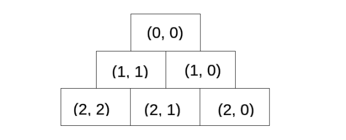

# Задачи

## Задача 1

Асистентите по ООП са решили да тестват автоматично задачите на
студентите тази година
и се нуждаят от вашата помощ да напишат системата си.

Класовете, които трябва да имплементирате:
Error, Test Case, Test Suit.
<br>
Всяка задача по ООП ще си има собствен набор от тестове наричан TestSuite (Тестов Пакет).
Той трябва да има:

<ul>
<li> Име (може да се променя)
<li> Множество тестови сценарии (използвайте написан от вас клас `Vector` от седмица 4)
<li> Възможност за изпълнение на всички тестови сценарии
<li> Възможност за добавяне на нов сценарии към множеството
<li> Възможност за филтриране на преминаващи/непреминаващи сценарии
<li> Възможност за филтриране на сценариите по тип грешка
<li> Възможност за премахване на всички тестови сценарии с даден тип
грешка
<li> Възможност за цветно принтиране на информация
</ul>

TestCase (Тестов сценарий) <br>
Тестов сценарии представлява отделен тест за точно една функционалност.
Всеки сценарий трябва да има:

<ul>
<li> Име
<li> Набор от функции за тестване (засега ще напишем само 3 лесни такива):
<ul>
<li> assertTrue - приема булев аргумент и проверява дали стойността му е истина
<li> assertEquals - приема два аргумента и проверява дали са равни по стойност
<li> assertNotNull - приема указател към обект и проверява, че той не е nullptr
</ul>
<li> Възможност да се провери дали теста е бил успешен
<li> Възможност да се провери дали има грешка
<li> Възможност да се провери типа на грешката
<li> Възможност да се провери съобщението на грешката
</ul>

Всеки тест може да е успешен, а може и да не е. Когато един тест не е минал
успешно е необходимо да имаме допълнителна информация какво се е счупило.
За тази цел тестовите сценарии могат да имат грешка, която трябва да има:

<ul>
<li> Тип (Празна/Никаква грешка, Грешка при компилация, Предупреждение,
Неуспех при сравнение)
<li> Съобщение
<li> Възможност да се проверява типа на грешката
<li> Възможност да се проверява дали грешката има съобщение
<li> Възможност да се проверява съобщението на грешката ако има такова
<li> Възможност да се създава нова грешка от всеки един тип
</ul>

```c++
    /// Create a new error of type None with no message
    /// We will be creating new Errors only via the 4 methods below
    static Error newNone();

    /// Create a new error of type BuildFailed with a message
    static Error newBuildFailed(const char*);

    /// Create a new error of type Warning with a message
    static Error newWarning(const char*);

    /// Create a new error of type FailedAssertion with a message
    static Error newFailedAssertion(const char*);
```

## Задача 2

Направете шаблонен клас Matrix със следните полета:

```c++
T** data
size_t rows
size_t cols
```

и следните методи:

<ul>
<li> конструктор по подразбиране
<li> конструктор с параметри
<li> copy конструктор
<li> operator=
<li> деструктор
<li> setElement(size_t i, size_t j, T element) – задава стойност element на
клетка (i, j)
<li> operator+ - събиране на матрици(ако не са с еднакъв размер да изпише
грешка на екрана и да върне празен обект от тип Matrix)
<li> operator* - умножение на матрици(ако матриците не са с съответния
размер да изпише грешка на екрана и да върне празен обект от тип
Matrix)
<li> print() - принтира матрицата по подходящ начин
<li> operator<< - принтира матрицата по подходящ начин
</ul>

## Задача 3

### <span style="color:orange">от контролно 2019 ООП, КН</span>.

Да се създаде клас Triangle, представляващ равностранен
„триъгълник“ от елементи от произволен тип T. Максималният брой редове на
триъгълника е фиксиран и се задава като параметър при конструиране на обект
от класа. Всеки елемент на триъгълника се указва с двойка индекси (i, j)
съгласно фигура 1:
<br><br>

<br><br>
За класа да се реализират:

<ul>
<li> конструктор, създаващ триъгълник с един елемент и фиксиран
максимален брой редове
<li> необходимите канонични методи от голямата четворка
<li> метод getRows, връщащ броя на редовете на триъгълника
<li> оператор s » t, която добавя нов ред в основата на триъгълника t и
прочита стойностите на елементите му от потока s. Считаме, че типът T
поддържа оператор ».
<li> метод getAt(i, j), който връща елемента намиращ се на позиция (i, j), като
при некоректни индекси връща елемента на позиция (0, 0)
<li> булев метод isSymmetric, който проверява дали е вярно, че триъгълника е
симетричен относно височината към основата му. Считаме, че типът T
поддържа операциите == и !=.
</ul>


# Задача 4
Реализирайте клас наредена двойка (`Pair`), който съдържа две променливи от произволен тип. Напишете конструктор с параметри, get-ъри и set-ъри за атрибутите на класа, както и метод, който връща максималния елемент от наредената двойка. Предефинирайте операторите `==` и `!=` за `Pair`.

**Бонус:** Модифицирайте `Pair` да работи и с две променливи от произволни различни типове.

# Задача 5
Напишете клас `Calculator`, който има две променливи от template-ен тип. Предефинирайте следните оператори на класа `Calculator`:

- operator+ - събира двете полета
- operator- - изважда двете полета
- operator* - умножава двете полета
- operator/ - разделя двете полета
- operator== - сравнява двете полета

# Задача 6
Съществуват няколко начина за обработване на грешки в различните езици за програмиране. Тук ще разгледаме един от тях.

## Error

Даден е клас `Error`, който пази в себе си съобщение за грешка.

## Optional

Даден е клас `Optional<T>`, който може да съдържа даден елемент, но може и да е празен.

Проверката дали даден `Optional` обект е празен, се извършва от метода `isNone()`

Можем да вземем стойността на `Optional` обект (дори и да е празен), чрез метода `getValue()` - ако обекта е празен, пак се очаква да върнем обект празен от тип `T` .

Един `Optional<T>` е празен, когато не му подадем аргумент в конструктора.
## Result

Даден е клас `Result<T>`, който може да съдържа даден резултат, или пък грешка (от тип `Error`).

Предефинирайте оператора за сравнение (==), така че да приема `Error` или `T` и да връща дали дадения `Result` обект е грешка или не.

Напишете методи, за връщане на резултата и грешката, като използвате `Optional` (все пак, може и да нямаме резултат, или пък да нямаме грешка) .


## Пример за оператор== при Result:
Result<int>(3) == int() -> true
Result<int>(5) == Error() -> false
Result<int>(“Error Message”) == Error() -> true